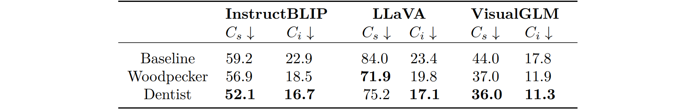

# A Unified Hallucination Mitigation Framework for Large Vision-Language Models


<font size=3><div align='center' >  \[[Read our arXiv Paper]()\]</div></font>

-----------------
> Hallucination is a common problem for Large Vision-Language Models (LVLMs) with long
generations which is difficult to eradicate. The generation with hallucinations is partially
inconsistent with the image content. To mitigate hallucination, current studies either focus on
the process of model inference or the results of model generation, but the solutions they design
sometimes do not deal appropriately with various types of queries and the hallucinations
of the generations about these queries. To accurately deal with various hallucinations, we
present a unified framework, Dentist, for hallucination mitigation. The core step is to
first classify the queries, then perform different processes of hallucination mitigation based
on the classification result, just like a dentist first observes the teeth and then makes a
plan. In a simple deployment, Dentist can classify queries as perception or reasoning and
easily mitigate potential hallucinations in answers which has been demonstrated in our
experiments. On MMbench, we achieve a 13.44%/10.2%/15.8% improvement in accuracy on
Image Quality, a Coarse Perception visual question answering (VQA) task, over the baseline
InstructBLIP/LLaVA/VisualGLM.

To the best of our knowledge, our work is the first to distinguish treatment based on the classification of hallucinations and use a validation cycle for the removal of hallucinations. We encourage readers with questions to contact us at cjcy89253033@gmail.com.


## Baseline
We first select 3 currently mainstream LVLMs as our baseline models, including [InstructBLIP](https://github.com/salesforce/LAVIS/tree/main/projects/instructblip),
[LLaVA](https://github.com/haotian-liu/LLaVA), and [VisualGLM](https://github.com/THUDM/VisualGLM-6B).

The sizes of baseline parameters are as followed, and please refer to [our paper]() for more details. 

<p align="center">
    
</p>

## Experiment
We use the above three models to complete experiments on MMbench, LLaVA-QA90, CHAIR and POPE. For comparison, each experiment set up [Woodpecker](https://github.com/BradyFU/Woodpecker) as a control.
The experimental results are shown below, and you can check [our paper]() for more details.

### MMbench Result
<p align="center">
    
</p>

### LLaVA-QA90 Result
<p align="center">
    
</p>

### CHAIR Result
<p align="center">
    
</p>

### POPE Result
<p align="center">
    
</p>

## Example
<p align="center">
    
</p>


## Setup
1. To setup a conda environment

```bash
conda create -n dentist python=3.9
conda activate dentist
```

2. Install related packages

- There may be environment conflicts between different benchmarks. Please configure according to the specific environment. The requirements.txt below only contains the basic packages.

```bash
pip install -r requirements.txt
```

3. Download the baseline model
- [InstructBLIP](https://huggingface.co/lmsys/vicuna-7b-v1.1)
- [LLaVA](https://huggingface.co/llava-hf/llava-1.5-7b-hf)
- [VisualGLM](https://huggingface.co/THUDM/chatglm-6b)

4. Install Dentist 
```bash
cd Dentist_ws
pip install -e .
```

## Demo
you can run the LlaVA demo with config in ./Dentist/config/llava/llava_config.ini (need to fill in)
```bash
cd Dentist_ws
python demo.py
```

change config file
```bash
cd Dentist_ws
python demo.py --config_path new_path
```

or you can specify by this way
```bash
cd Dentist_ws
python demo.py --device 0 --limited_cnt 1 --model_path your_path --openai_key your_key
```

## Code Tree
```bash
.
├── demo.py
└── Dentist
    ├── config
    │   ├── instructblip
    │   ├── llava
    │   └── visualglm
    │
    └── model
        ├── instructblip
        │   └──instructblip_verifier.py
        │
        ├── llava
        │   └──llava_verifier.py
        │
        ├── only_detection
        │   ├── instructblip_detector.py
        │   ├── llava_detector.py
        │   └── visualglm_detector.py
        │
        ├── verifier.py
        │
        └── visualglm
            └── visualglm_verifier.py
```
The base class is in Dentist/model/verifier.py

Inherited rewriting of base class functions can be referred to the other folders in Dentist/model/

## Acknowledgement
This work is inspired by [MMbench](https://github.com/open-compass/MMBench) and [Woodpecker](https://github.com/BradyFU/Woodpecker). Sincerely thanks for their awesome works.


## Citation
```bash

```